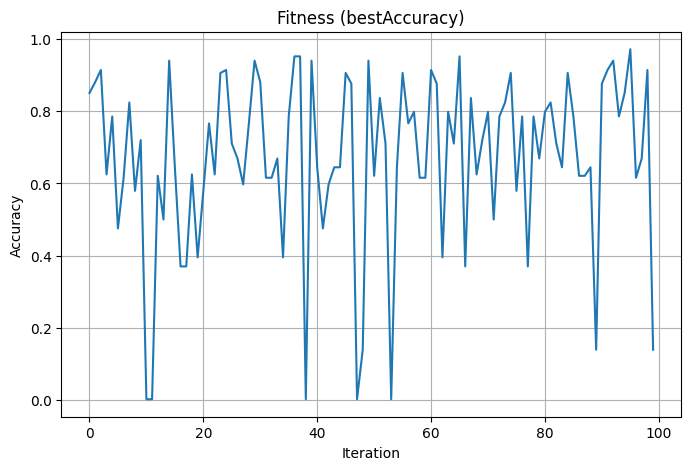

# 🧠 SVM Optimization on Multi-Class UCI Dataset

## 📌 Objective

This project focuses on optimizing Support Vector Machine (SVM) classifiers on a multi-class dataset using different randomized train-test splits and hyperparameter combinations. The aim is to:
- Train and evaluate SVM models across 10 random samples.
- Optimize the SVM hyperparameters using 100 random iterations.
- Record the best accuracy and parameters for each sample.
- Plot the convergence graph for the best performing model.

---

## 📚 Dataset Used

- **Source**: UCI Machine Learning Repository
- **Dataset**: Letter Recognition Dataset
- **Samples**: 20,000 records × 16 features
- **Classes**: 26 (A to Z)

---

## ⚙️ Experiment Setup

- **Splits**: 10 randomized 70:30 train-test splits
- **Model**: `sklearn.svm.NuSVC` (Non-linear SVM)
- **Optimization**:
  - Iterations: 100 per sample
  - Parameters optimized:
    - `kernel`: ['rbf', 'poly', 'sigmoid']
    - `nu`: (0.01 to 1)
    - `epsilon`: (0.01 to 1)

---

## 📈 Results

### 🔢 Best Accuracies & Parameters

| Sample | Best Accuracy | Best Parameters         |
|--------|----------------|--------------------------|
| S1     | 96.97%         | rbf, 0.01, 0.56          |
| S2     | 97.17%         | rbf, 0.01, 0.34          |
| S3     | 96.82%         | rbf, 0.01, 0.23          |
| S4     | 96.85%         | rbf, 0.01, 0.45          |
| S5     | 96.78%         | rbf, 0.01, 0.23          |
| S6     | 96.42%         | rbf, 0.01, 0.45          |
| S7     | 95.00%         | poly, 0.01, 0.56         |
| S8     | 97.12%         | rbf, 0.01, 0.45          |
| S9     | 96.57%         | rbf, 0.01, 0.45          |
| S10    | 97.05%         | rbf, 0.01, 0.78          |

---

### 📊 Convergence Graph

The graph below shows the fitness (accuracy) across 100 iterations for the best-performing sample (S2):

